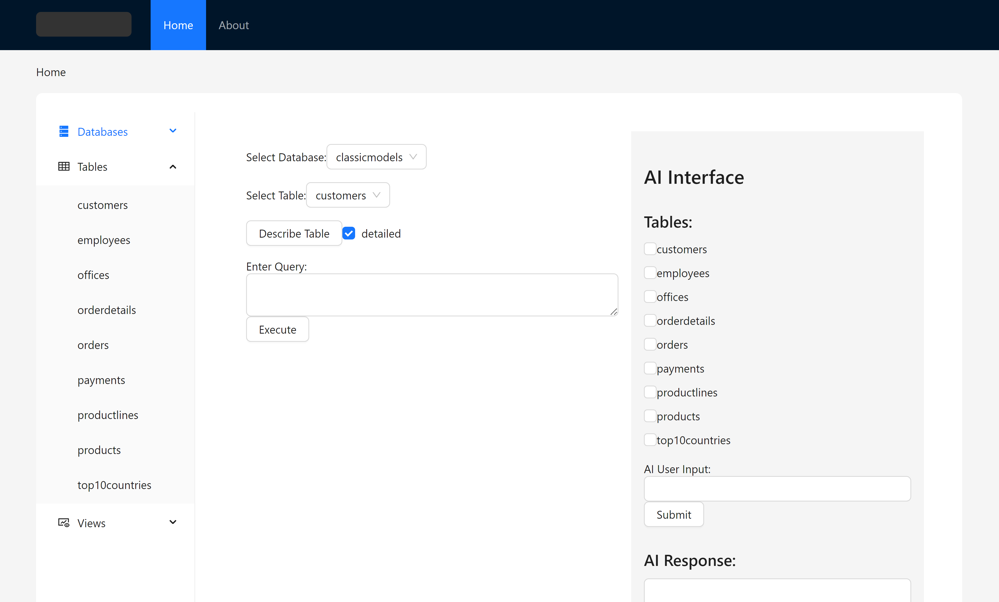
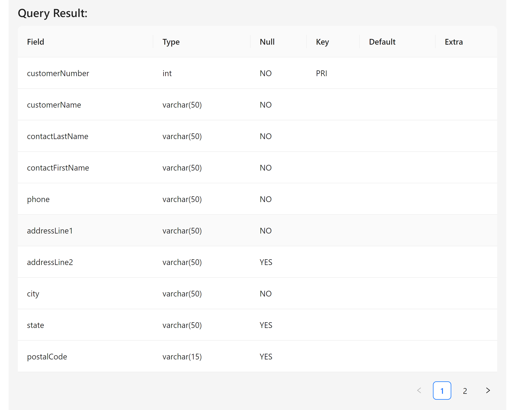

# SphinxQL

SphinxQL is a project aimed at integrating LLMs with SQL databases. The project is in its very early stages and we are actively seeking contributors to help us build and improve it.


The main goal of SphinxQL is to use the power of AI to assist with SQL database management and querying. We use the `sqlcoder` model from hugginface generate SQL queries based on natural language prompts. This is done with the help of Ollama, which serves as the AI backend.

> I'm crafting more standardised readme file which will include more info about the model


## Flowchat

Sketching...

## Current Progress

- [x] Setup basic project structure
- [x] Integrate `sqlcoder` model
- [x] API endpoints for database operations
- [x] AI input prompting with table data
- [x] Frontend dahsboard for DB and tables information, AI interface and query output structure
- [x] Custom query execution and direct table description

- [ ] UI Improvement
- [ ] Move all environmental variables to .env
- [ ] Deep integration of LLMS with database
- [ ] Automatic error analysis and re-prompting

- [ ] Compile frontend and backend into standalone electron project


## Running the Project

The project is divided into two main parts: the frontend and the backend. Both parts need to be running for the application to work.

### Ollama Server

You will have to install and serve ollama in the system to support backend with *SQLCoder* model

```sh
ollama pull sqlcoder
ollama serve
```

### Backend

The backend is a Node.js server that connects to the database and serves the frontend. To start the server, navigate to the `backend` directory and run:

```sh
cd backend
npm start
```
Remember to fill in you're database credentials in backend. .env implementation is under development

### Frontend

```sh
cd frontend
npm start
```

Finally open `http://localhost:3000` to open project

## Working with dashboard

> It's a in a very early stage of development with only some days of work as solo in this project yet.




1) Select the database you want to work with from listed all available databsses
2) Once database is choosen, all available tables will be listed and can be describes 
3) In the AI interface, select the tables you want to add to the prompt and write a prompt for any reuired sql output
4) An sql query required will be generated with accuracy according to the need and that will be executed and output table will be displayed below

## Contributing

We welcome contributions from everyone. If you're interested in contributing, please fork the repository and make your changes. Once you're done with your changes, open a pull request for review.

## License

This project is licensed under the MIT License - see the [LICENSE](LICENSE) file for details.

## Issues

If you encounter any issues or have any questions, please [open an issue](https://github.com/gd03champ/SphinxQL/issues) on the GitHub repository.

## Contact

For any further inquiries or collaborations, feel free to contact me [here](https://gd03.me/contact).

## Acknowledgements

We would like to thank the following contributors for their valuable contributions to this project:

- Only me for now 

## Resources

- Updating

## Roadmap

Our future plans for SphinxQL include:

- Enhancing the AI query generation capabilities
- Adding support for additional database systems
- Improving integration with LLMS
- Implementing automatic error analysis and re-prompting
- Developing advanced analytics and data visualization features

We appreciate your interest in SphinxQL and look forward to your contributions!
